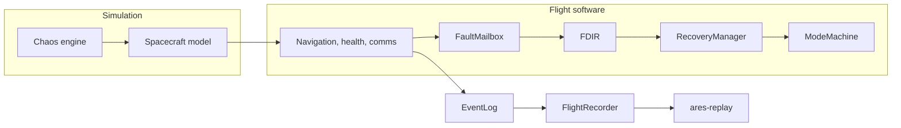

# ARES

ARES (Autonomous Resilient Embedded Spacecraft System) is a C++20 flight-software simulation. It runs a bounded, deterministic spacecraft: periodic tasks, a mode machine, fault detection, two autonomous recovery actions, and an optional binary mission recorder with an offline replay tool.

This repository is a systems-programming portfolio project. It is not flight-certified software, and it is not a spacecraft.

## Why it exists

Flight software has to stay predictable when a sensor lies, a task misses its deadline, or a log fills up. ARES is a small vehicle you can boot, fault-inject, recover, record, and replay on a desk, with the resource limits written down instead of implied.

## What it demonstrates

- Modern C++20 systems programming and explicit concurrency
- A deterministic simulation with a manual clock
- Embedded-style bounded memory on the flight path
- Fault detection, isolation, and recovery
- Autonomous navigation restart and primary-to-backup GPS failover
- Hardware interfaces that keep the simulator out of flight policy
- A versioned little-endian recording and a checked replay parser
- Warnings-as-errors, clang-tidy, and AddressSanitizer / UndefinedBehaviorSanitizer

## Capabilities

| Version | What landed |
| --- | --- |
| 0.1 | Scheduler, supervisor, deadline monitor, mode machine |
| 0.2 | Simulated spacecraft and hardware interfaces |
| 0.2.1 | Freshness, deterministic noise, checked simulation arithmetic |
| 0.3 | Bounded fault registry and typed faults |
| 0.3.1 | Deadline escalation and SafeMode recovery |
| 0.4 | Deterministic chaos scenarios |
| 0.5 | Navigation restart and GPS failover, each verified before success |
| 0.6 | Flight recorder, CRC, and `ares-replay` |
| 0.7 | Release presets, CI, demos, install, and operator-facing output |

## Architecture

Simulation changes what a device returns or how long a task appears to have run. Flight software reads the hardware interfaces, publishes observations, and is the only writer of fault and recovery state. The recorder watches. It does not steer.



The contracts are in [docs/ARCHITECTURE.md](docs/ARCHITECTURE.md), [docs/FAULT_MODEL.md](docs/FAULT_MODEL.md), [docs/RECOVERY.md](docs/RECOVERY.md), [docs/CHAOS_ENGINE.md](docs/CHAOS_ENGINE.md), [docs/FLIGHT_RECORDER.md](docs/FLIGHT_RECORDER.md), and [docs/REPLAY.md](docs/REPLAY.md).

## Design rules

- The simulation is deterministic. Flight logic does not read the wall clock.
- Flight-path tables are fixed capacity. A full registry or recorder keeps a defined prefix.
- The health task is the only writer of the fault registry and of recovery progress.
- Faults and recoveries use typed identities, not strings.
- Workers are `std::jthread`s owned by the supervisor. Nothing is detached.
- Recovery success is verified. A restart or a failover is not success by itself.
- Chaos does not write faults or request modes.
- The recorder is an observer. A recording failure does not change a flight decision.
- Replay keeps file order. Sequence is the total order. A later record may carry an earlier logical timestamp.

## Quick start

Linux, or Windows in an MSYS2 UCRT64 shell, with CMake, Ninja, and GCC or Clang:

```sh
cmake --preset debug
cmake --build --preset debug
ctest --preset debug --output-on-failure
./build/debug/ares --duration-ms 250
./build/debug/ares --list-scenarios
```

On Windows the binaries are `ares.exe` and `ares-replay.exe`. A release build uses `--preset release` and `build/release`. The interview walkthrough is [docs/DEMO.md](docs/DEMO.md). Tool versions and the format/tidy/sanitizer commands are in [CONTRIBUTING.md](CONTRIBUTING.md).

## Run

```text
ares [--duration-ms N] [--scenario NAME] [--seed N] [--record FILE]
ares --list-scenarios
ares-replay [--verify] [--summary] FILE
```

`--duration-ms` defaults to 250. `--scenario` defaults to `nominal`. `--seed` defaults to 0. Named scenarios use zero measurement noise. Omit `--record` and nothing is written. `--record` truncates the destination before boot.

A finished mission prints one summary. It has no wall-clock stamp, process id, or pointer. Fault and recovery counts are the events still held in the bounded event log.

## Scenarios

`nominal`, `gps_stale`, `gps_unavailable`, `imu_invalid`, `low_battery`, `deadline_storm`, `mixed_faults`, `nav_restart`, and `restart_fail`.

`gps_stale` is the GPS failover demonstration. `nav_restart` is the successful navigation restart. `restart_fail` holds the delay through both attempts and stays in SafeMode. `deadline_storm` is the shorter delay and is unchanged from v0.4.

## Autonomous recovery

Navigation may be restarted at most twice in one episode, on the same worker. Success is three consecutive on-time completions from the new generation. Primary GPS can fail over to backup once. Success is three usable backup samples after the switch. There is no automatic return to primary. A failed GPS recovery stays failed for that mission.

## Flight recorder

The recording format is 1.0: a 64-byte header, a 20-byte record prefix, explicit little-endian fields, and CRC32 over the record, the stream, and the header. The header also stores the ARES version that wrote the file. Replay checks the format version, not that application version. `ares-replay` validates the bytes and prints a timeline. It does not restore C++ objects or run the tasks again.

## Testing

```sh
ctest --preset debug --output-on-failure
ctest --test-dir build/debug -L unit --output-on-failure
ctest --test-dir build/debug -L integration --output-on-failure
```

Labels also include `fault`, `recovery`, `recorder`, `replay`, and `smoke`. Each test has a 60-second timeout.

## Exit codes

| Code | Name | Meaning |
| --- | --- | --- |
| 0 | Success | The mission finished and, if recording was on, the recording operation succeeded |
| 1 | BootFailed | Boot or StartMission was rejected |
| 2 | UsageError | Bad arguments or an unknown scenario |
| 3 | WorkerException | A task threw. This outranks a recording failure |
| 4 | ScheduleFault | A task could not advance its schedule |
| 5 | HookFault | A task hook failed |
| 6 | UnknownWorkerFault | A worker stopped for an unclassified fault |
| 7 | StartupFailed | A worker or a scenario could not be started |
| 8 | TimeError | A clock sample or a duration did not fit |
| 9 | FaultHistoryOverflow | The deadline-miss log overwrote an older miss, and no worker fault outranks it |
| 10 | RecorderFailed | The flight result was success, but the recording could not be opened, finished, or kept only an overflow prefix |

A recovery failure does not by itself change the process exit code.

## Install

```sh
cmake --install build/release --prefix /tmp/ares
```

That installs `ares`, `ares-replay`, and the design docs. `cpack -G TGZ` or `cpack -G ZIP` from the release build directory packs the same install set.

## Repository

`include/ares` and `src` hold core, flight, simulation, recorder, and the composition root. `tests/unit` and `tests/integration` are the suite. `docs` holds the contracts. `scripts` holds the four demos.

## Known limits

- Deadline checks on the host clock describe desktop scheduling, not a real-time executive.
- The `ares` executable uses the host steady clock, so two process runs are not byte-identical. Manual-clock campaigns are.
- Communications dropout is not implemented.
- There is no GPS failback, checkpoint rollback, or process restart.
- The event log and the recorder are separate bounded histories. One can drop an event the other still holds.
- Scenario names longer than 15 characters are truncated in the recording header. The shipped names fit.
- ThreadSanitizer is not part of CI. The supported Linux environment used during development aborts it before any test.
- MSVC is unsupported.

## Documents

- [docs/DEMO.md](docs/DEMO.md)
- [docs/PRODUCT_SPEC.md](docs/PRODUCT_SPEC.md)
- [docs/ROADMAP.md](docs/ROADMAP.md)
- [docs/MEMORY.md](docs/MEMORY.md)
- [CONTRIBUTING.md](CONTRIBUTING.md)
