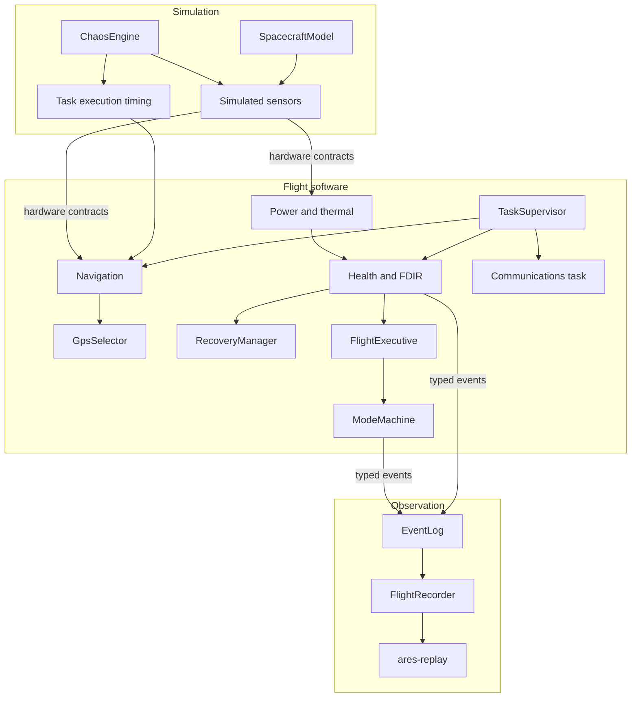

# ARES

ARES (Autonomous Resilient Embedded Spacecraft System) is a deterministic C++20 spacecraft flight-software simulator. It focuses on fault detection, bounded autonomous recovery, and post-mission replay.

It models embedded-style resource limits and still runs on a developer workstation. It is not flight-certified software, and it is not a spacecraft.

## What it demonstrates

- C++20 and explicit concurrency with joined threads
- A deterministic spacecraft simulation and hardware abstraction
- Periodic navigation, health, and communications tasks
- Deadline monitoring, FDIR, and SafeMode
- Chaos fault injection that does not write flight state
- Navigation restart and primary-to-backup GPS failover
- Recovery that counts only after verification
- Bounded flight-state tables
- A binary flight recorder and a checked offline replay
- CI, clang-format, clang-tidy, and AddressSanitizer / UndefinedBehaviorSanitizer

| Version | What landed |
| --- | --- |
| 0.1 | Scheduler, supervisor, deadline monitor, mode machine |
| 0.2 | Simulated spacecraft and hardware interfaces |
| 0.2.1 | Freshness, deterministic noise, checked simulation arithmetic |
| 0.3 | Bounded fault registry and typed faults |
| 0.3.1 | Deadline escalation and SafeMode recovery |
| 0.4 | Deterministic chaos scenarios |
| 0.5 | Navigation restart and GPS failover, each verified before success |
| 0.6 | Flight recorder, CRC, and `ares-replay` |
| 0.7 | Release presets, CI, install, and operator-facing output |
| 1.0 | Four canonical demonstrations of that system |

The ten-minute walkthrough is [docs/DEMO.md](docs/DEMO.md). Milestone notes are [docs/RELEASE_NOTES.md](docs/RELEASE_NOTES.md).

Selected NASA software-engineering and software-assurance practices, with project-specific tailoring, are recorded under [docs/assurance/SOFTWARE_ASSURANCE_PLAN.md](docs/assurance/SOFTWARE_ASSURANCE_PLAN.md). That record is not NASA certification, NASA approval, or flight qualification.

## Architecture

Simulation changes what a device returns or how long a task appears to have run. Flight software reads hardware interfaces. The health task is the only writer of fault and recovery state. The recorder watches. It does not steer.



Contracts: [docs/ARCHITECTURE.md](docs/ARCHITECTURE.md), [docs/FAULT_MODEL.md](docs/FAULT_MODEL.md), [docs/RECOVERY.md](docs/RECOVERY.md), [docs/CHAOS_ENGINE.md](docs/CHAOS_ENGINE.md), [docs/FLIGHT_RECORDER.md](docs/FLIGHT_RECORDER.md), and [docs/REPLAY.md](docs/REPLAY.md).

## Resilience

A sensor fault:

Chaos freezes the primary GPS, freshness reports stale, FDIR records a persistent warning, the mode becomes Degraded, recovery isolates the primary and selects the backup, three usable backup samples verify the switch, and the mode returns to Nominal. Selection stays on the backup.

A task fault:

Chaos adds navigation delay, the deadline monitor records misses, FDIR escalates to Critical and SafeMode, recovery restarts the same worker, the generation changes, three on-time completions verify the restart, and SafeMode returns to Standby. A delay that outlasts both attempts ends in `RecoveryFailed`. There is no third attempt.

## Determinism

Tests use `ManualClock`, an explicit mission seed, SplitMix64 sensor streams, and fixed chaos schedules. The flight recorder orders records by sequence. Replay parses that order and does not sort by timestamp.

The `ares` executable uses the host steady clock. Two process runs are not byte-identical. A loaded machine can add deadline misses that a manual-clock campaign does not.

## Resource bounds

Flight-state structures are bounded. That is not a claim that the whole process never allocates. Logging formats a line when it emits, and replay may allocate offline. Capacities:

| Structure | Capacity |
| --- | --- |
| FaultRegistry | 19 |
| Chaos schedule | 16 |
| FlightRecorder | 256 |
| EventLog | 64 |
| Deadline-miss history | 32 |

The full table is [docs/MEMORY.md](docs/MEMORY.md).

## Quick start

Linux, or Windows in an MSYS2 UCRT64 shell, with CMake, Ninja, and GCC or Clang:

```sh
cmake --preset debug
cmake --build --preset debug
ctest --preset debug --output-on-failure
./build/debug/ares --duration-ms 250
./build/debug/ares --list-scenarios
```

On Windows the binaries are `ares.exe` and `ares-replay.exe`. A release build uses `--preset release` and `build/release`. Toolchain and check commands are in [CONTRIBUTING.md](CONTRIBUTING.md).

```text
ares [--duration-ms N] [--scenario NAME] [--seed N] [--record FILE]
ares --list-scenarios
ares-replay [--verify] [--summary] FILE
```

`--duration-ms` defaults to 250. `--scenario` defaults to `nominal`. `--seed` defaults to 0. Named scenarios use zero measurement noise. Omit `--record` and nothing is written. `--record` truncates the destination before boot.

## Scenarios

`nominal`, `gps_stale`, `gps_unavailable`, `imu_invalid`, `low_battery`, `deadline_storm`, `mixed_faults`, `nav_restart`, and `restart_fail`.

`gps_stale` is the GPS failover demonstration. `nav_restart` and `restart_fail` are demonstration names for delay injections that already existed in the campaign tests. A host run of `nav_restart` does not always reach the restart; [docs/DEMO.md](docs/DEMO.md) describes that timing caveat. `deadline_storm` remains the 4-second delay from v0.4.

Navigation may be restarted at most twice in one episode, on the same worker. Success is three consecutive on-time completions from the new generation. Primary GPS can fail over to backup once. Success is three usable backup samples after the switch. There is no automatic return to primary.

The recording format is 1.0. Replay checks that format version, not the application version stored in the header. `ares-replay` does not restore C++ objects or run the tasks again.

## Quality

The suite is GoogleTest, discovered by CTest, with `unit` and `integration` labels plus `fault`, `recovery`, `recorder`, `replay`, and `smoke`. Campaign tests repeat the same manual-clock mission and compare the result. Project code is built with warnings as errors. `ares-format-check` and `ares-tidy` run clang-format and clang-tidy. The `asan-ubsan` preset enables AddressSanitizer and UndefinedBehaviorSanitizer and is not linked into `debug` or `release`.

GitHub Actions runs Linux Debug, Linux Release, Linux ASan/UBSan, and Windows UCRT64 Debug. ThreadSanitizer is not in that workflow. The WSL environment used during development aborts it before any test, so it is not reported as passed.

```sh
ctest --preset debug --output-on-failure
ctest --test-dir build/debug -L unit --output-on-failure
ctest --test-dir build/debug -L integration --output-on-failure
```

## Exit codes

| Code | Name | Meaning |
| --- | --- | --- |
| 0 | Success | The mission finished and, if recording was on, the recording operation succeeded |
| 1 | BootFailed | Boot or StartMission was rejected |
| 2 | UsageError | Bad arguments or an unknown scenario |
| 3 | WorkerException | A task threw. This outranks a recording failure |
| 4 | ScheduleFault | A task could not advance its schedule |
| 5 | HookFault | A task hook failed |
| 6 | UnknownWorkerFault | A worker stopped for an unclassified fault |
| 7 | StartupFailed | A worker or a scenario could not be started |
| 8 | TimeError | A clock sample or a duration did not fit |
| 9 | FaultHistoryOverflow | The deadline-miss log overwrote an older miss, and no worker fault outranks it |
| 10 | RecorderFailed | The flight result was success, but the recording could not be opened, finished, or kept only an overflow prefix |

A recovery failure does not by itself change the process exit code.

## Install

```sh
cmake --install build/release --prefix /tmp/ares
```

That installs `ares`, `ares-replay`, and the design docs. From the release build directory, `cpack -G TGZ` or `cpack -G ZIP` packs the same install set. The package does not contain the test binary or object files. Windows binaries are built for MSYS2 UCRT64 and the ZIP is not standalone: `libstdc++-6.dll`, `libgcc_s_seh-1.dll`, and `libwinpthread-1.dll` must be on `PATH`. A UCRT64 shell already provides them.

## Known limits

- Deadline checks on the host clock describe desktop scheduling, not a real-time executive.
- Communications dropout is not implemented.
- There is no GPS failback, checkpoint rollback, or process restart.
- The event log and the recorder are separate bounded histories.
- Scenario names longer than 15 characters are truncated in the recording header. The shipped names fit.
- MSVC is unsupported. Windows binaries need the UCRT64 runtime DLLs on `PATH`.

## Documents

- [docs/DEMO.md](docs/DEMO.md)
- [docs/RELEASE_NOTES.md](docs/RELEASE_NOTES.md)
- [docs/PRODUCT_SPEC.md](docs/PRODUCT_SPEC.md)
- [docs/ROADMAP.md](docs/ROADMAP.md)
- [docs/MEMORY.md](docs/MEMORY.md)
- [CONTRIBUTING.md](CONTRIBUTING.md)
